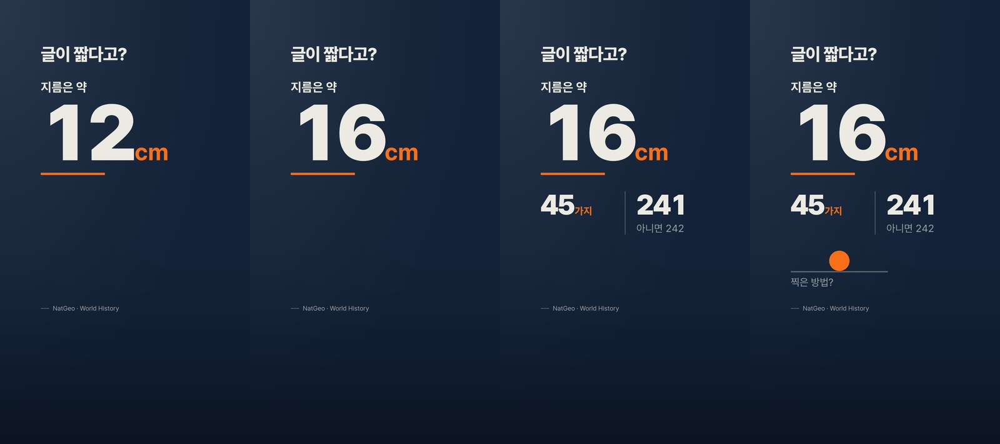
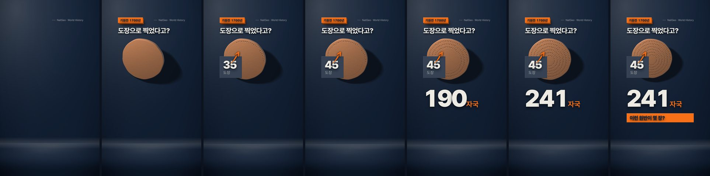

# Slide calibration examples

Read these images before authoring or reviewing a slide. They are historical comparison
material, not pre-approved output, a source for factual claims, or scores to copy. The current
render-routing, chart and mesh contracts override older techniques visible in the examples.
These come from the 2026-09-02 broadcast template and 2026-09-04 object study. Navy and orange
belong to that channel's theme; the reusable lesson is structure, not its palette.

## Before: information too small for the phone

The second and third panels compress numbers and labels into a small part of a tall frame.
Compare their text hierarchy at phone size against the next image. Do not treat the adjoining
photographs as rejected media; the failure being illustrated is the diagram's scale.

## Better hierarchy: one measured value first

The leading measurement is large, the unit stays beside it, and supporting quantities enter
later. Use that reading order, not these example numbers. This strip alone cannot establish
timing or narration alignment. Under today's chart rules a comparison needs a shared scale;
a large numeral is not a substitute for a data graph or an explanation of a physical mechanism.

## Better integration: subject and stage share light

The object, cast shadow, plates and ground share a light direction. Its visible marks change
between states while the value changes. Use those relationships when inspecting a new scene.
This is a synthetic fixture, not footage of a real artifact or historical evidence.
This legacy sheet does not authorize sprite sheets for new physical subjects: use the current
mesh lane and inspect full-rate playback. Never infer continuous motion quality from this strip.

## How to use the pair in a review

1. Name the relevant example and the one property being compared: hierarchy, integration or
   state change. Do not reward copying the palette, object or layout without a reason.
2. Cite the new slide's actual frame and location, then the narration or token it should match.
3. A source/code inspection or an example image cannot earn points for unseen output.
   Preserve the rubric's 95-point and zero-P0 threshold; there is no automatic example pass.

Source context: [broadcast study](../../../docs/research/2026-09-02-broadcast-slide-design/index.html)
and [object study](../../../docs/research/2026-09-04-rendered-object-slide/index.html).
